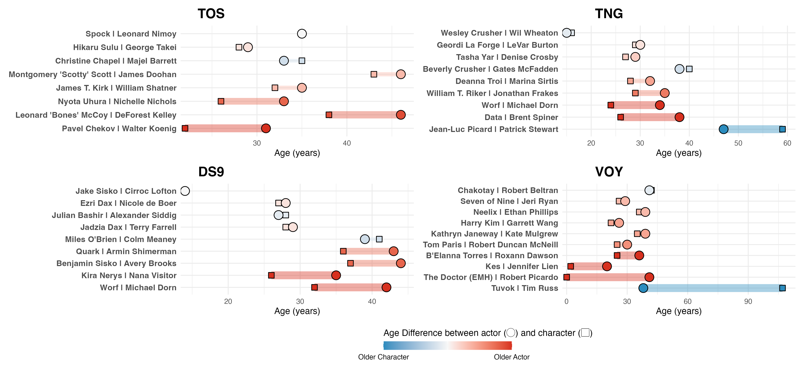

# [Star Trek: For the Ages](https://mayankles.github.io/StarTrekForTheAges/)

#### An exploration of the ages of the characters of Star Trek and the actors who portrayed them. 

Is it silly? Yes. But this exercise helped me appreciate the awesome power of wikis like [Memory Alpha](https://memory-alpha.fandom.com/wiki/Portal:Main), which exist thanks to the care and dedication of so many individual fans.

And in retrospect, I think this is a good example of using LLMs to collect organized but distributed information into a tidy dataset for further analysis/visualization.

---

#### Some more details in the R Markdown report [here](https://mayankles.github.io/StarTrekForTheAges/)

---

Four flagship series were selected for analysis:

- The Original Series (TOS)
- The Next Generation (TNG) 
- Deep Space Nine (DS9)
- Voyager (VOY)

<b>
Age information was compiled from online sources by ChatGPT 5 Thinking on/around August 24, 2025.
</b>

## Actor vs. Character Ages in Star Trek Series

## Why this exists
During my latest rewatch of Star Trek: The Next Generation, I started wondering how old the characters are supposed to be at the start of each series—and how that compares to the **actors’ real ages** when the shows premiered. That curiosity turned into a fun, productive back-and-forth with **ChatGPT 5**, where we pulled together a small, tidy dataset and a set of visualizations.

**Headline "finding" lol:** for human characters across these series, actors are **generally a few years older** than their characters. The biggest gaps show up for **non-human/artificial** roles (e.g., Data, Tuvok, the EMH) where in-universe aging doesn’t map to human years.

---

## What’s here
- `trek_actor_vs_character_ages.csv` — the curated dataset  
- `trek_actor_vs_character_ages_report.Rmd` — R Markdown report that builds per-series plots and a final multi-panel figure  
- `trek_multipanel_delta_winsor.png` — the combined 2×2 figure  
- `.gitignore` — Mac + R/Rmd friendly ignore file (also ignores `testing/`)

---

## Data collection & assumptions (short version)
- **Character ages** use commonly accepted **in-universe birth/activation years** at **series start** (or **join season** for later additions).  
  Examples: Chekov (TOS S2), Worf (DS9 S4), Seven of Nine (VOY S4).  
  Special cases: Data’s “age” from **reactivation (2338)**; the **EMH** is **0** at activation; **Tuvok** is ~107 at VOY start.
- **Actor ages** are calculated on each series’ **U.S. premiere date** (or join-season premiere), using public DOBs.
- If a character’s canonical birth year **isn’t established on screen** (e.g., Pulaski, Odo), that row stays in the CSV but is **omitted from numeric plots**.

> Sources used at a high level: Memory Alpha for character timelines; Wikipedia/official bios for actor birthdays and series premiere dates. This is a best-effort, fan-grade compilation—not a canonical reference.

---

## CSV columns
- `Series` — TOS, TNG, DS9, VOY  
- `Character`, `Actor`  
- `CharacterAge`, `ActorAge` — ages at series start (or join season)  
- `AtStartOrJoin` — e.g., `S1`, `S4`  
- `Notes` — context (activation, joins later, etc.)  
- `Delta_ActorMinusCharacter` — `ActorAge − CharacterAge`

---

## How to reproduce the figures
1. Open `trek_actor_vs_character_ages_report.Rmd` in RStudio (or run with `rmarkdown::render()`).
2. The report **reads the CSV** (no hard-coded data).
3. It first prints **per-series paired dotplots** (with Δ in the y-axis labels), then builds a **final multi-panel** figure with a diverging color scale for Δ.

**Color scaling options**
- `winsor75` (default) — robust scaling that caps extremes at the 75th percentile  
- `signedlog` — smooth compression via a signed log transform

You can change the mode via the Rmd `params`.

---

## Dependencies
`ggplot2`, `dplyr`, `tidyr`, `patchwork`, `scales` (and base R Markdown tooling). Install lines are included as comments at the top of the Rmd.

---

## Results at a glance
- Actors trend **older than characters** by a small margin (positive median Δ in each series).  
- **Outliers** tend to be aliens/AI (Data +12, EMH +41, Tuvok −69 vs. a human comparison), which is exactly where “human years” aren’t the right yardstick.

---

## Future ideas
- Add **Enterprise** or **Strange New Worlds** for a broader compare.  
- Include **confidence/uncertainty flags** for character ages with mixed canon.  
- Enrich the CSV with **Wikidata IDs** for easier cross-linking.

---

